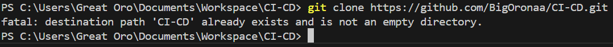
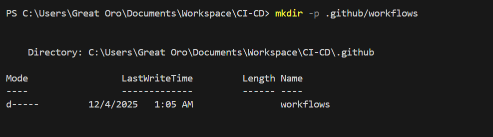
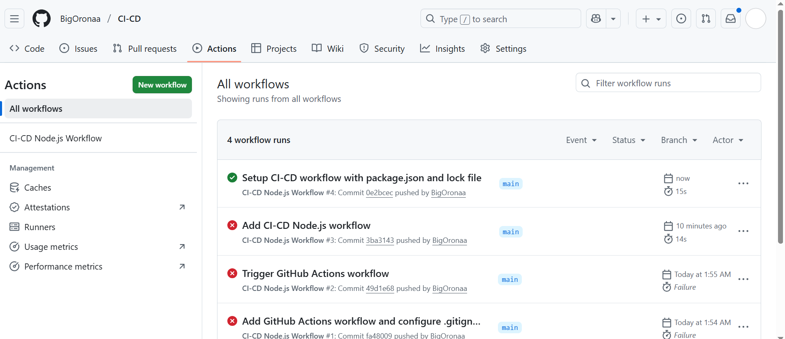
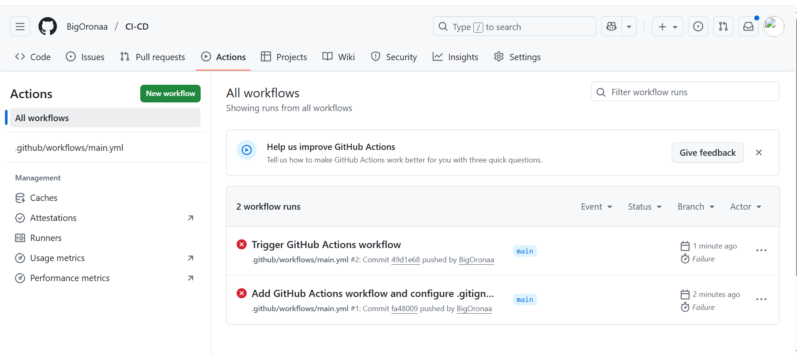
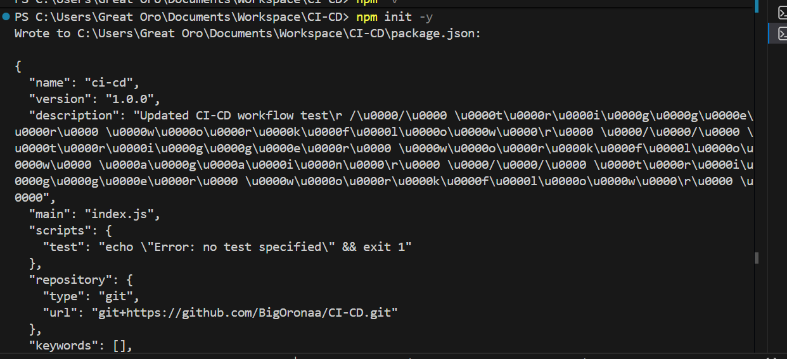
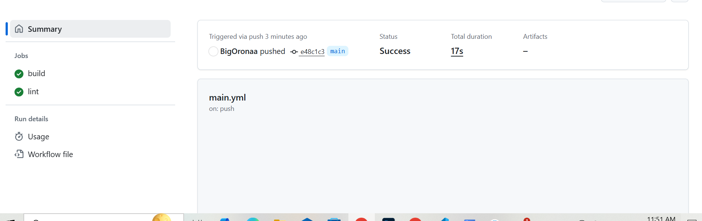
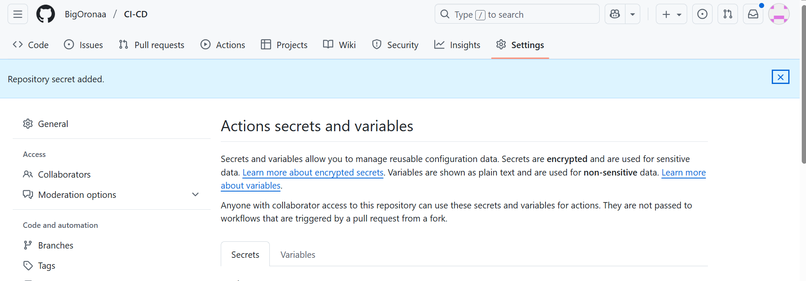
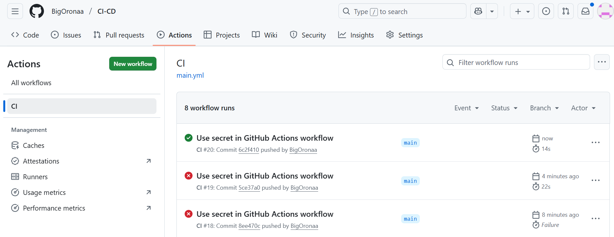
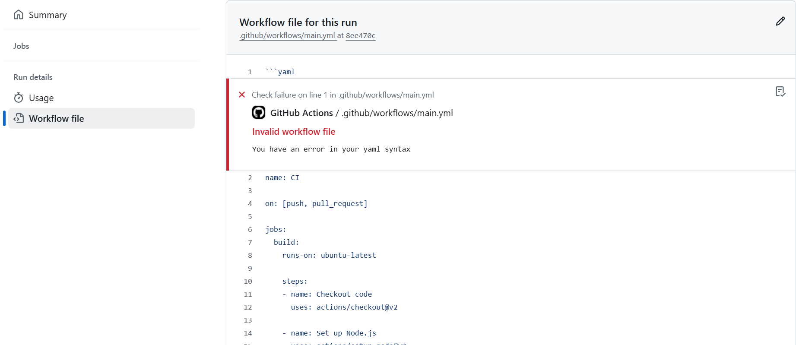

# GitHub Actions Lab Guide

## Objective

By the end of this lab, I will:

-   Understand the basic concepts of GitHub Actions.
-   Create a simple GitHub Actions workflow.
-   Set up environment variables.
-   Automate running tests on my repository.
-   Automate deployment to an environment.

------------------------------------------------------------------------

## Step 1: Create a New GitHub Repository

1.  I go to GitHub and created a new repository.\
2.  I initialize the repository with a **README.md** file.\
3.  I clone the repository:

``` sh
git clone https://github.com/Bigoronaa/CI-CD.git
cd CI_CD
```

### I added Screenshots



------------------------------------------------------------------------

## Step 2: Create a Workflow Directory

I create a directory for GitHub Actions workflows:

``` sh
mkdir -p .github/workflows
```

### I added Screenshots


------------------------------------------------------------------------

## Step 3: Create a Simple Workflow

I create the workflow file:

``` sh
touch .github/workflows/main.yml
```

I open the file and add:

``` yaml
name: CI

on: [push, pull_request]

jobs:
  build:
    runs-on: ubuntu-latest

    steps:
    - name: Checkout code
      uses: actions/checkout@v2

    - name: Set up Node.js
      uses: actions/setup-node@v2
      with:
        node-version: '14'

    - name: Install dependencies
      run: npm install

    - name: Run tests
      run: npm test
```

Then I commit and push:

``` sh
git add .github/workflows/main.yml
git commit -m "Add initial GitHub Actions workflow"
git push origin main
```

------------------------------------------------------------------------

## Step 4: Trigger the Workflow

-   I make any change to the repository.
-   I push the changes.
-   I check the **Actions** tab to see the workflow run.

### I added Screenshots



**Error Encountered** It failed on the first trigger. I installed npm changed the node from 14 to 20 and it was successful.

### I added Screenshots


### I added Screenshots


------------------------------------------------------------------------

## Step 5: Add Multiple Jobs

I update **main.yml**:

``` yaml
name: CI

on: [push, pull_request]

jobs:
  build:
    runs-on: ubuntu-latest

    steps:
    - name: Checkout code
      uses: actions/checkout@v2

    - name: Set up Node.js
      uses: actions/setup-node@v2
      with:
        node-version: '14'

    - name: Install dependencies
      run: npm install

    - name: Run tests
      run: npm test

  lint:
    runs-on: ubuntu-latest

    steps:
    - name: Checkout code
      uses: actions/checkout@v2

    - name: Set up Node.js
      uses: actions/setup-node@v2
      with:
        node-version: '14'

    - name: Run linter
      run: npm run lint
```

Then I commit and push:

``` sh
git add .github/workflows/main.yml
git commit -m "Add lint job to GitHub Actions workflow"
git push origin main
```

### I added Screenshots



------------------------------------------------------------------------

## Step 6: Use Secrets in Workflows

I create a secret:

1.  Go to **Settings** → **Secrets and Variables** → **Actions**
2.  Click **New repository secret**
3.  Add secret name: `MY_SECRET`


### I added Screenshots


Then I modify workflow:

``` yaml
- name: Use secret
  run: echo ${{ secrets.MY_SECRET }}
```

Push the changes:

``` sh
git add .github/workflows/main.yml
git commit -m "Use secret in GitHub Actions workflow"
git push origin main
```

### I added Screenshots


**Errors Encountered** There was an error on line one, it made the initial push to fail, so i did it several times until it was successful. i corrected the mistake on the first line and truggered again.

### I added Screenshots


------------------------------------------------------------------------

## Step 7: Deployment Example (Optoonal)

``` yaml
name: CI

on: [push]

jobs:
  build:
    runs-on: ubuntu-latest

    steps:
    - name: Checkout code
      uses: actions/checkout@v2

    - name: Set up Node.js
      uses: actions/setup-node@v2
      with:
        node-version: '14'

    - name: Install dependencies
      run: npm install

    - name: Build
      run: npm run build

    - name: Deploy to GitHub Pages
      uses: peaceiris/actions-gh-pages@v3
      with:
        github_token: ${{ secrets.GITHUB_TOKEN }}
        publish_dir: ./build
```

This step was optional so i left it undone


------------------------------------------------------------------------

## Conclusion

In this lab, I successfully created and configured multiple GitHub
Actions workflows for CI, linting, secrets usage, and optional
deployment.
