# GitLab CI/CD Lab Guide with VSCode

## Objective
I learnt how to set up and use GitLab CI/CD for automating workflows. I aim to automate tasks such as:
- Running tests
- Building applications
- Deploying code

I used Visual Studio Code (VSCode) as my primary editor.

## Prerequisites
- A GitLab account
- Visual Studio Code installed
- Git installed
- A repository to work with (I created a new one for this lab)

## Step 1: Create a New GitLab Repository
- I went to GitLab and created a new project.
- I initialized the repository with a `README.md` file.
- I cloned the repository to my local machine:

```bash
git clone https://gitlab.com/BigOronaa/gitlab-ci-lab.git
cd gitlab-ci-lab
```

### I added Screenshots
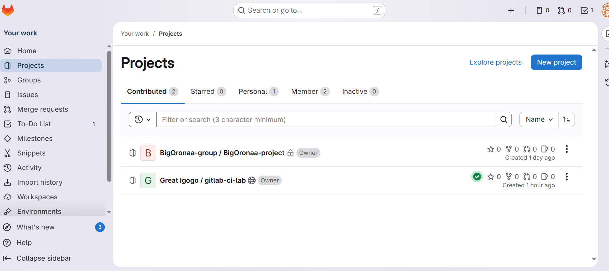


## Step 2: Create a .gitlab-ci.yml File
- I created a `.gitlab-ci.yml` file in the root of my repository:
  - Right-clicked in the Explorer pane and selected New File.
  - Named the file `.gitlab-ci.yml`.
  - Opened `.gitlab-ci.yml` and added the following content:

```yaml
stages:
  - build
  - test

build_job:
  stage: build
  script:
    - echo "Building the project..."
    - # Add your build commands here

test_job:
  stage: test
  script:
    - echo "Running tests..."
    - # Add your test commands here
```

**I used VScode interface to set commit and push it to git** 

### I added Screenshots
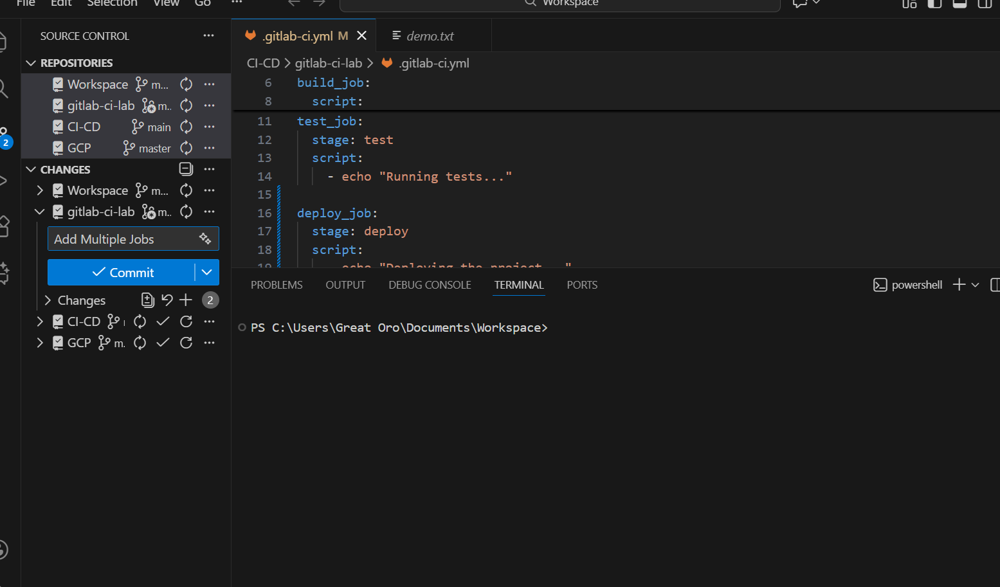
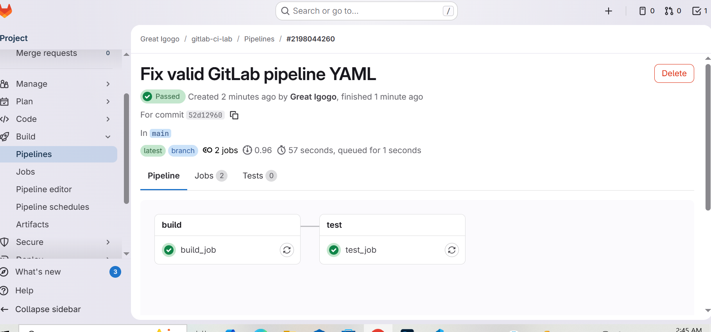
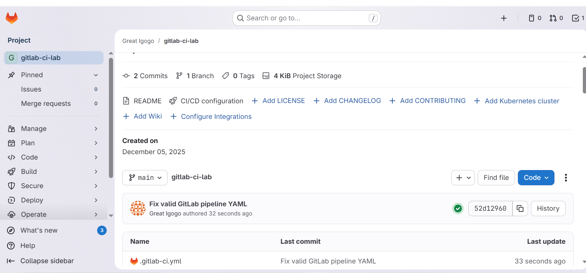


- **Error Encountered:**
During this step, git was unable to run pipeline because 'jobs:build_job:script config should be a string or a nested array of strings up to 10 levels deep'

I fixed this by using the correct YAML script and updating it.

### I added Screenshots
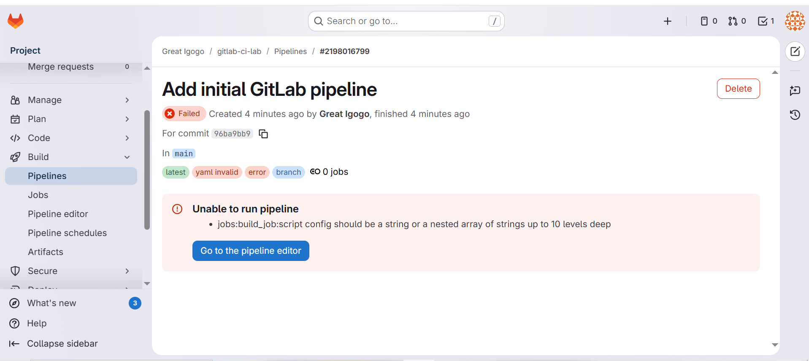


## Step 3: Trigger the Pipeline
- I made a change to my repository and pushed it to trigger the pipeline.
- I went to the "CI/CD" tab in my GitLab project to see the running pipeline.

### I added Screenshots
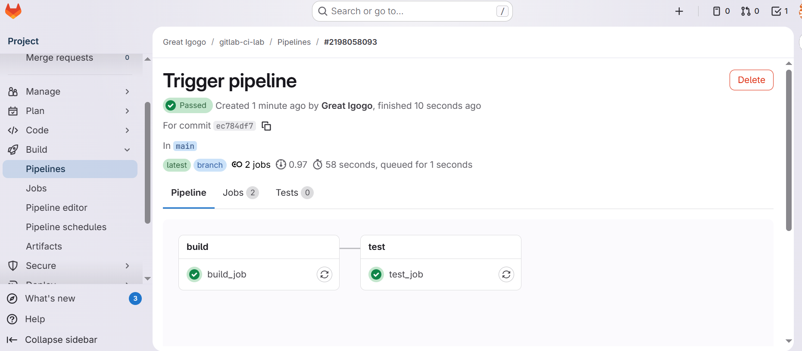


## Step 4: Create a Pipeline with Multiple Jobs
- I modified `.gitlab-ci.yml` to include multiple jobs:

```yaml
stages:
  - build
  - test
  - deploy

build_job:
  stage: build
  script:
    - echo "Building the project..."


test_job:
  stage: test
  script:
    - echo "Running tests..."

deploy_job:
  stage: deploy
  script:
    - echo "Deploying the project..."
```
- I committed and pushed the changes using VSCode.

### I added Screenshots
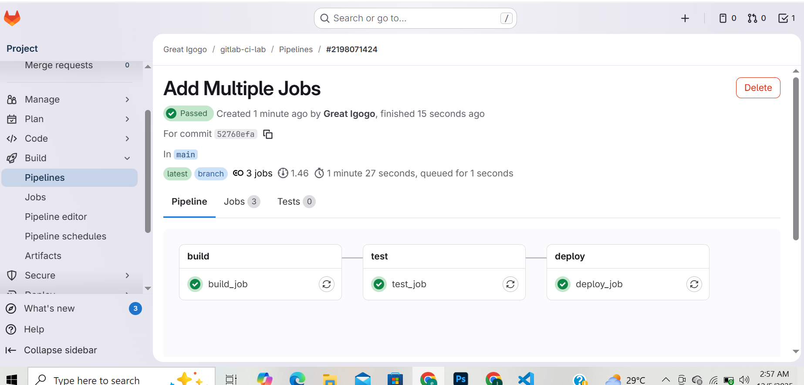

## Step 5: Use Variables in Your Pipeline
- I went to the "Settings" tab in my GitLab project.
- I clicked on "CI / CD" and expanded the "Variables" section.
- I added a new variable `MY_VARIABLE` with a value.

### I added Screenshots
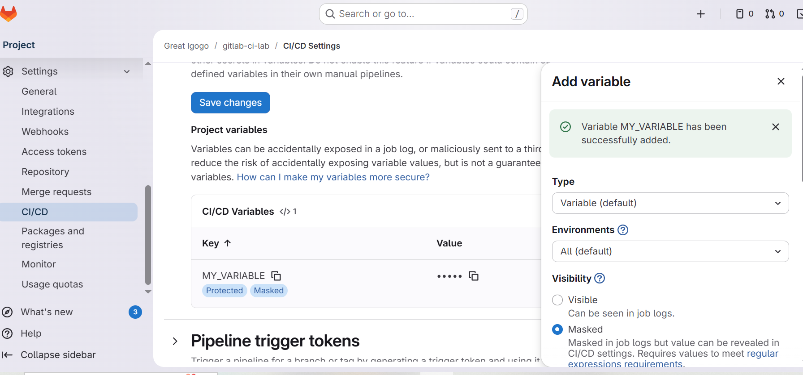

- I modified `.gitlab-ci.yml` to use the variable:

```yaml
stages:
  - build
  - test
  - deploy

build_job:
  stage: build
  script:
    - echo "Building the project..."

test_job:
  stage: test
  script:
    - echo "Running tests..."

deploy_job:
  stage: deploy
  script:
    - echo "Deploying the project..."
    - echo "Using variable: $MY_VARIABLE"
```
-------------------------------------------------------------------------------------

### I added Screenshots
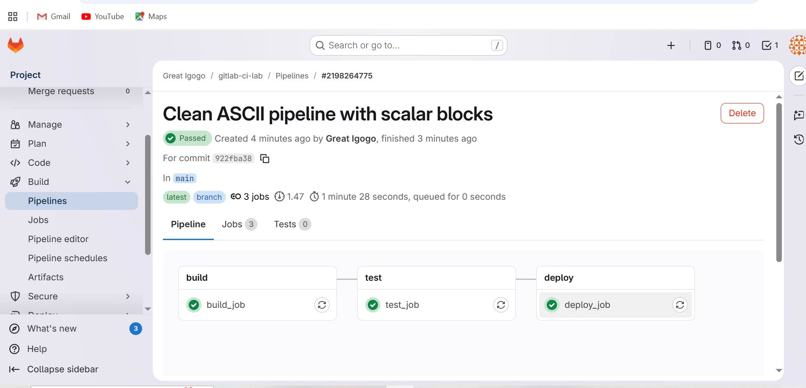

- **Error I encountered:** I noticed git was unable to run pipeline because 'jobs:build_job:script config should be a string or a nested array of strings up to 10 levels deep'

I fixed this by updating the script, used scalar blocks "|" to ensure the Script is seeing by Gitlab and ensured `$MY_VARIABLE` is referenced correctly in Bash.


### I added Screenshots
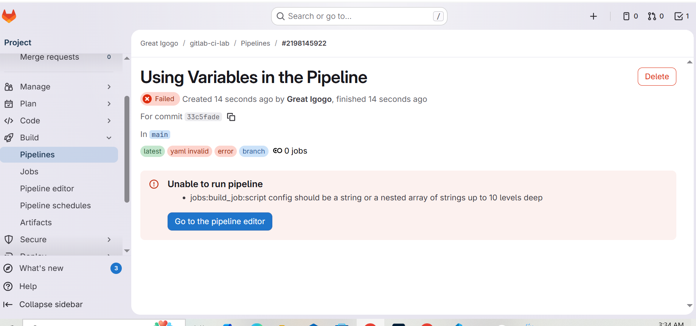
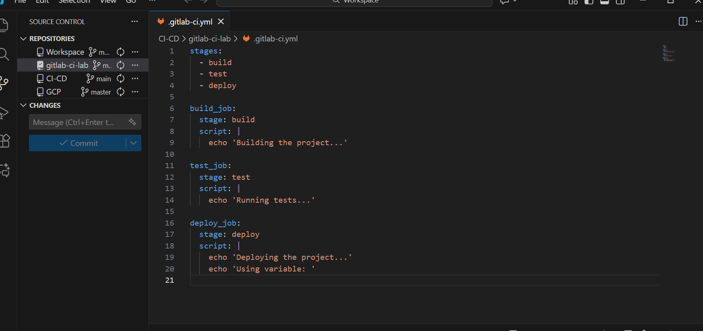

## Step 6: Define Artifacts
- I modified `.gitlab-ci.yml` to define artifacts:

```yaml
build_job:
  stage: build
  script:
    - echo "Building the project..."
    - mkdir dist
    - echo "Build output" > dist/output.txt
  artifacts:
    paths:
      - dist/

test_job:
  stage: test
  script:
    - echo "Running tests..."
    - cat dist/output.txt
  dependencies:
    - build_job

deploy_job:
  stage: deploy
  script:
    - echo "Deploying the project..."
    - cat dist/output.txt
  dependencies:
    - build_job
```
- I committed and pushed the changes using VSCode.

### I added Screenshots
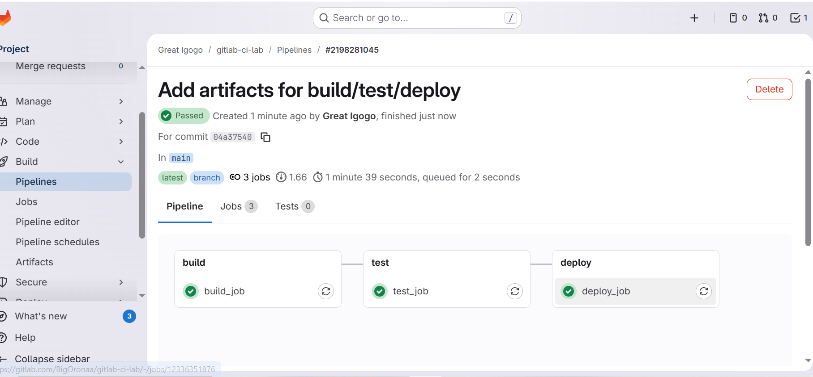


## Step 7: Deploy Your Application (Optional)
- This was optional, i left it undone but studied it so i can know it.
