# Jenkins Critical Thinking Project 


## Overview

In this project, **I designed, implemented, troubleshot, and optimized a
complete Jenkins CI/CD pipeline** that automates the Build → Test →
Package → Staging Deployment → Approval → Production Deployment
workflow.

### Tools Used

- Docker → to host Jenkins inside a container

- Jenkins LTS → CI/CD automation engine

- WSL 2 (Windows Subsystem for Linux) → required backend for Docker Desktop on Windows

- GitHub (Version control)

- VScode for writing files and deploying.


### Setup Process

- I Installed and Configured WSL 2

- I upgraded WSL to avoid Docker errors:
```bash
wsl --update
wsl --set-default-version 2
```

### Install Docker Desktop

- I Installed Docker Desktop for Windows

- Enabled WSL 2 backend

- No login required since this was a learning project


### I added Screenshots
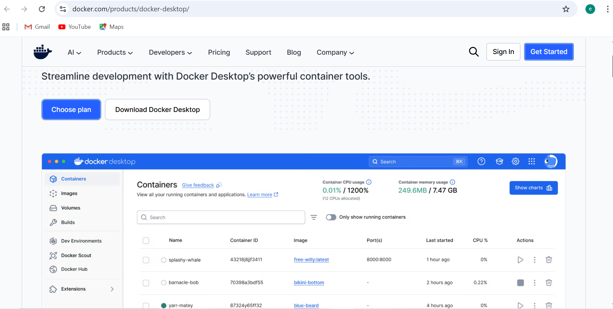
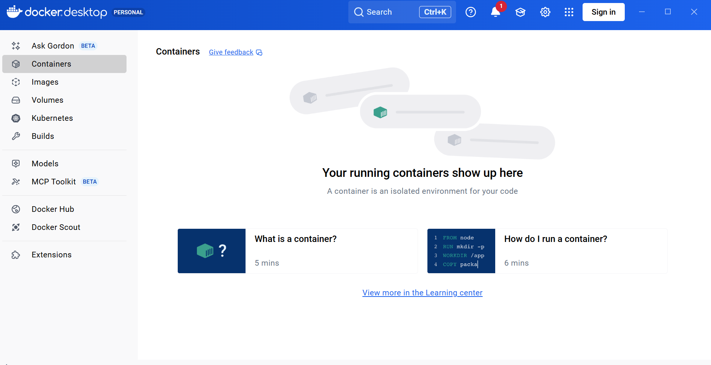

### Run Jenkins in Docker

- I pulled and ran the Jenkins LTS image:

```bash
docker run -d -p 8080:8080 -p 50000:50000 --name jenkins \
  -v jenkins_home:/var/jenkins_home \
  jenkins/jenkins:lts
```
**Docker downloaded all layers and started Jenkins successfully.**


### I added Screenshots
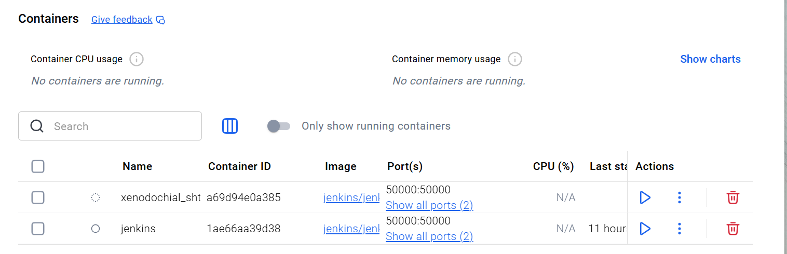

---------

### Jenkins Initial Setup

**Steps completed:**

-   I installed Jenkins and completed the initial setup.\
-   I configured the **Jenkins URL**, plugins, and admin user.\
-   I added **GitHub credentials (github‑creds)** for pipeline access.\
-   I connected Jenkins to my GitHub repo:\
    `https://github.com/BigOronaa/CI-CD`.


### I added Screenshots
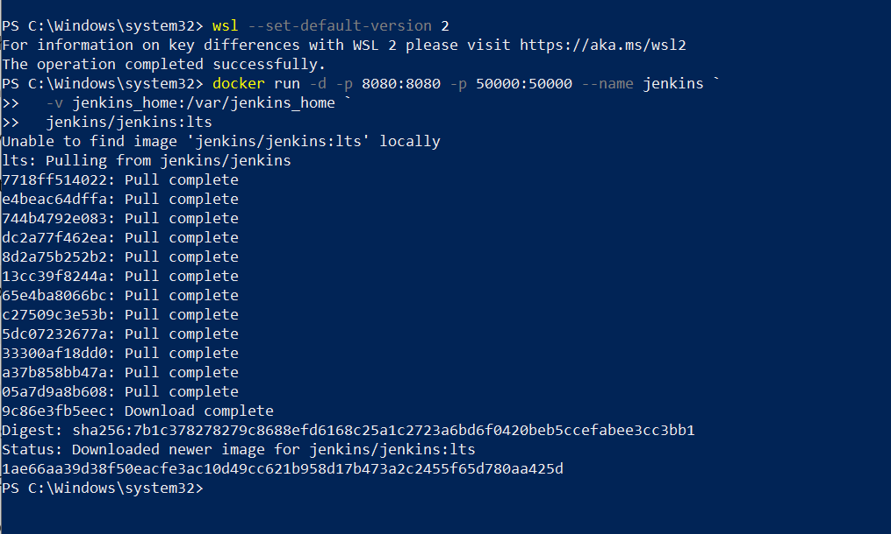
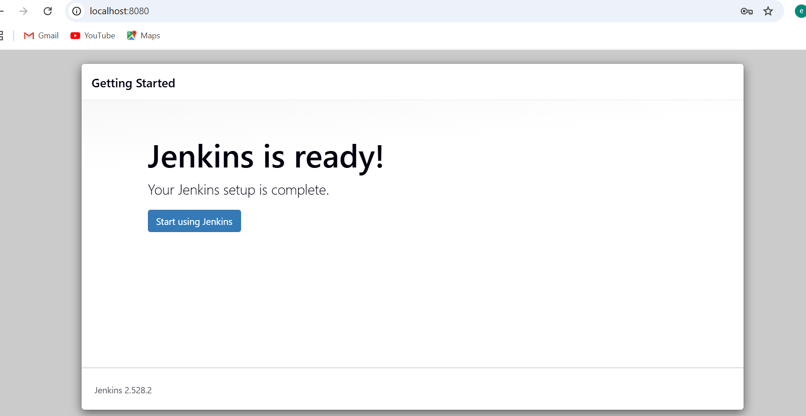
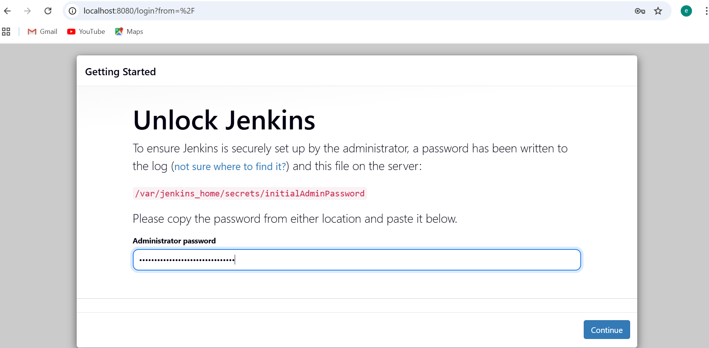


### Pipeline Requirements Implemented

**The pipeline was designed to match a real company scenario.**

- Stages Included: 

   - Build – compile source code

   - Test – automated tests

   - Package – create artifact or Docker image

   - Deploy to Staging – push to test environment

   - Approval – manual gate using input step

   - Production Deployment – deploy after approval

**Example Jenkinsfile (Pipeline-as-Code)**
```groovy
pipeline {
    agent any

    stages {
        stage('Build') {
            steps {
                echo "Building application..."
            }
        }

        stage('Test') {
            steps {
                echo "Running tests..."
            }
        }

        stage('Package') {
            steps {
                echo "Packaging application..."
            }
        }

        stage('Deploy to Staging') {
            steps {
                echo "Deploying to staging..."
            }
        }

        stage('Approval') {
            steps {
                input message: "Approve deployment to production?"
            }
        }

        stage('Production Deployment') {
            steps {
                echo "Deploying to production..."
            }
        }
    }
}
```

### Implenetation

***I simulated everything inside jenkins and VScode***

### 1. I Created a Pipeline job in Jenkins
  - Dashboard → New Item → Pipeline → OK
  - Pipeline → Definition → Pipeline script from SCM → Git
  - Repository URL → My GitHub repo URL
  - Credentials → My GitHub username/password
  - Branch → main

 Initial Pipeline Setup

I started by creating a **basic Jenkinsfile** with these stages:

- **Build**  
- **Test**  
- **Package**  
- **Deploy to Staging**  
- **Approval** (manual input)  
- **Deploy to Production**

***Each stage only used simple commands like `echo` because we were not working with a real application.***


### I added Screenshots
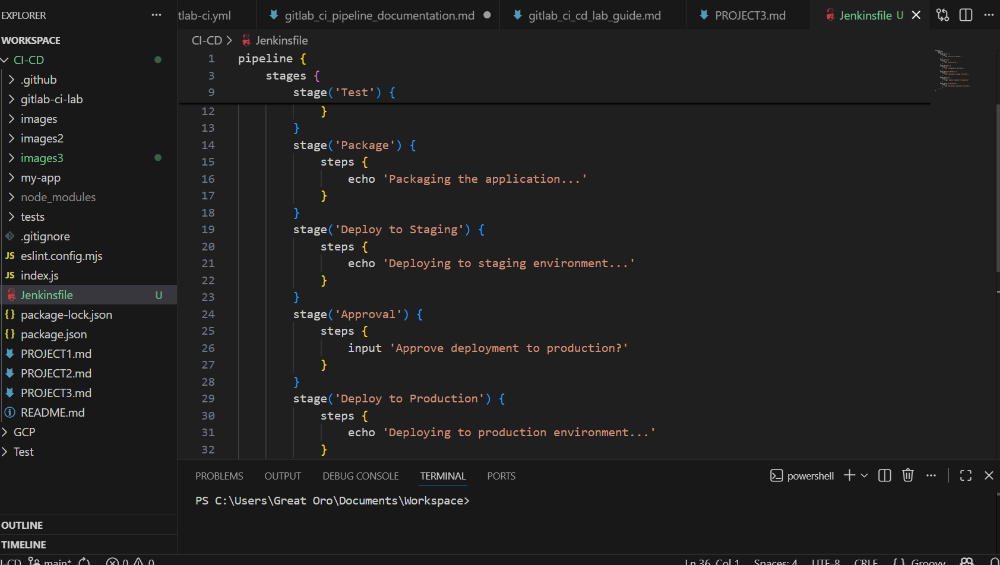


### 2. I Ran the Pipeline
 - I Clicked Build Now → Jenkins pulled the Jenkinsfile and run each stage.

When it reaches Approval, Jenkins paused until I approved it manually.

---

### I added Screenshots
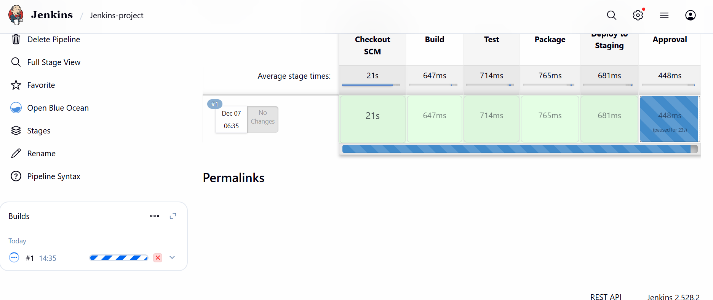


### 3. Adding Security (API Key Protection)

I created a Jenkins secret text credential:

- **Name:** `MY_API_KEY`
- **Type:** Secret Text

Then added this to the Jenkinsfile:

```groovy
withCredentials([string(credentialsId: 'MY_API_KEY', variable: 'API_KEY')]) {
    echo "Using credentials securely..."
}
```

### I added Screenshots
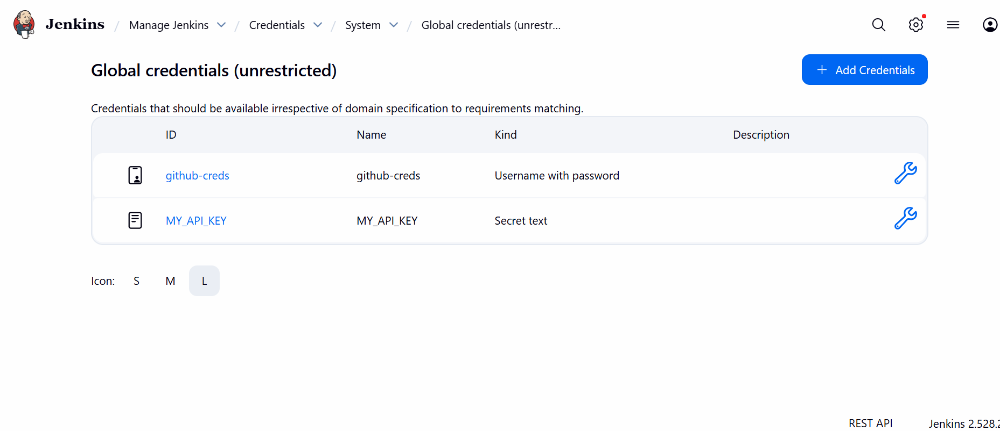


I confirmed from console output:

- API key was **masked**
- Pipeline printed `****` instead of the real value
- No leakage in Console Output

This completed the **security** requirement.

---

### I added Screenshots
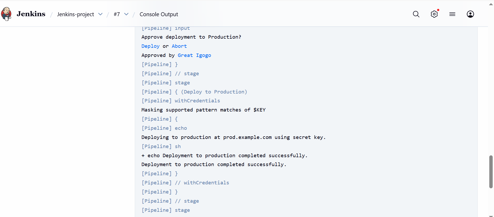


### 4. I implemented Errors

- I implemented error handling for the Jenkins pipeline. The goal was to simulate pipeline failures demonstrating how failures are caught and handled automatically.
- I added commands in the pipeline to simulate potential errors during the Package or Deploy to Staging stages.
- This allowed us to test how the pipeline responds to failures.

---

### I added Screenshots
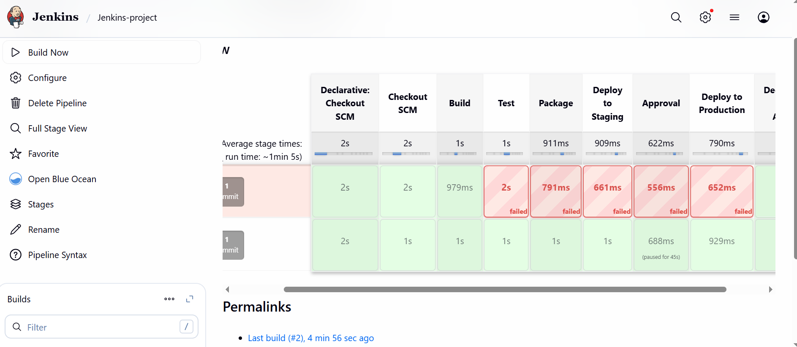


### 5. Adding Rollback Logic

I added a simple rollback simulation inside the `post { failure { ... } }` section:

```groovy
post {
    failure {
        echo "Pipeline failed — starting rollback..."
        sh 'echo Rolling back to previous stable version'
    }
}
```

This rollback:

- Was **not connected to a real deployment**
- Only printed a message
- Triggered automatically whenever a stage failed

---

### I added Screenshots

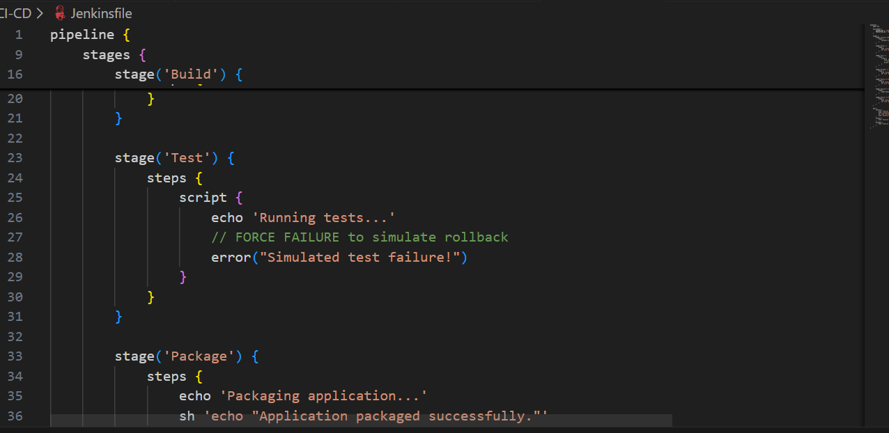


# 6. Testing Failures (Forced Test Break)

To test the rollback behavior, I forced a failure in the Test stage:

```sh
exit 1
```

Results:

- Pipeline failed  
- Approval and production stages skipped  
- Rollback message printed successfully  

 then removed `exit 1` to restore normal behavior.

---

### I added Screenshots
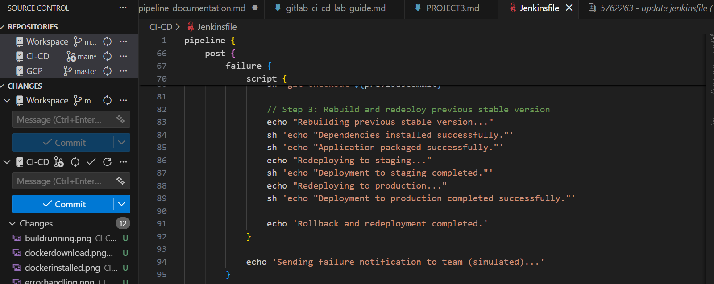


### 7. Adding Scalability (Simulated)

I added a multiple independent tasks (unit tests, linting) for scalability

```groovy
stage('Unit Tests') {
                    steps {
                        echo 'Running unit tests...'
                        sh 'echo "Unit tests passed!"'
                    }
                }
                stage('Lint') {
                    steps {
                        echo 'Running code linting...'
                        sh 'echo "Lint passed!"'
```

My **pipeline** handle multiple independent tasks (unit tests, linting) at the same time without breaking.

---


### I added Screenshots
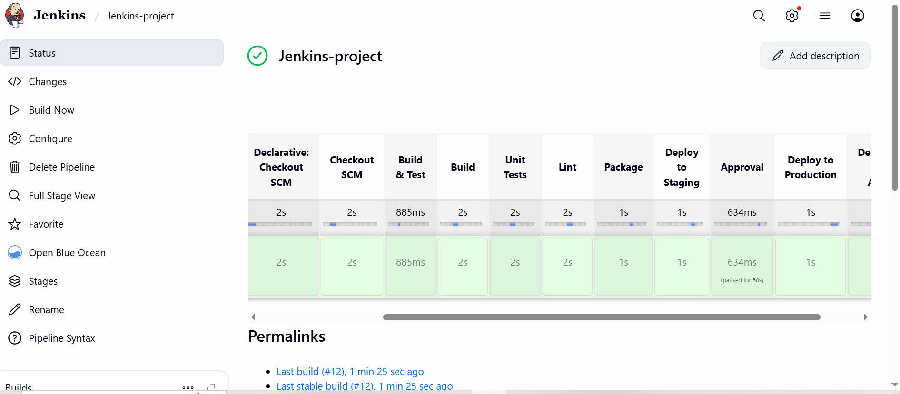

### 8. Logging (Simulated)

We improved logs by adding echo statements to every stage so the pipeline output was clearer:

- When dependencies “installed”
- When environments switched
- When deployment happened
- When rollback triggered

This was not real monitoring—only basic logging.

---

### I added Screenshots
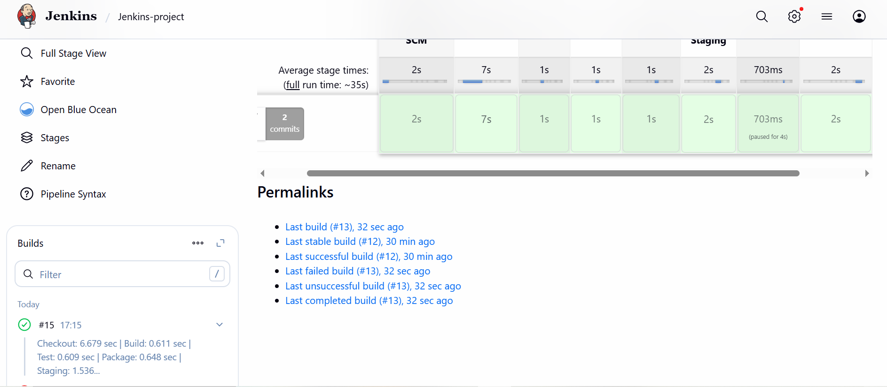

###  What I *completed*
- Fully working Jenkins pipeline  
- Git + Jenkins integration  
- Environment configuration  
- Basic build/test/package simulation  
- Manual approval gate  
- Secure credential handling  
- Rollback triggered on failure  
- Scalability (simulated only)  
- Logging through echo statements  