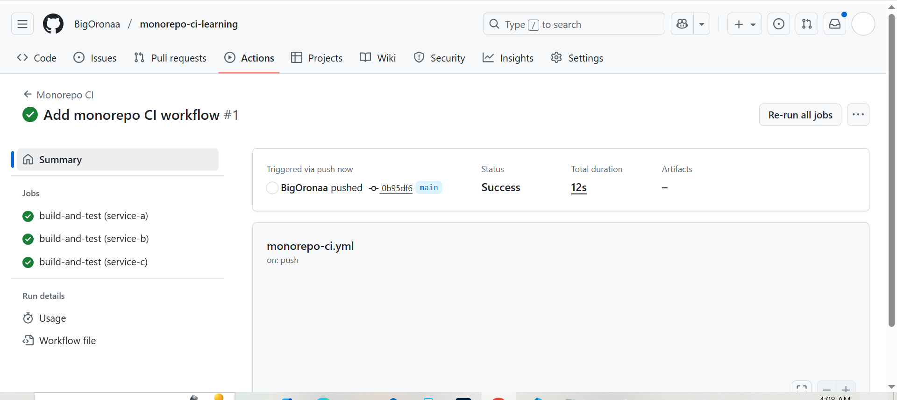
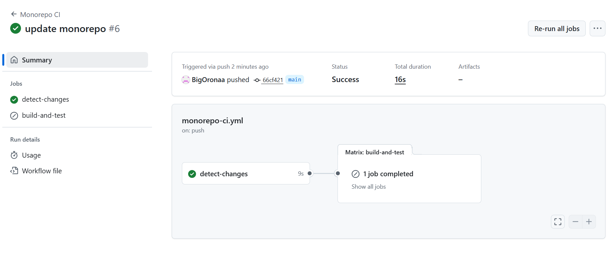
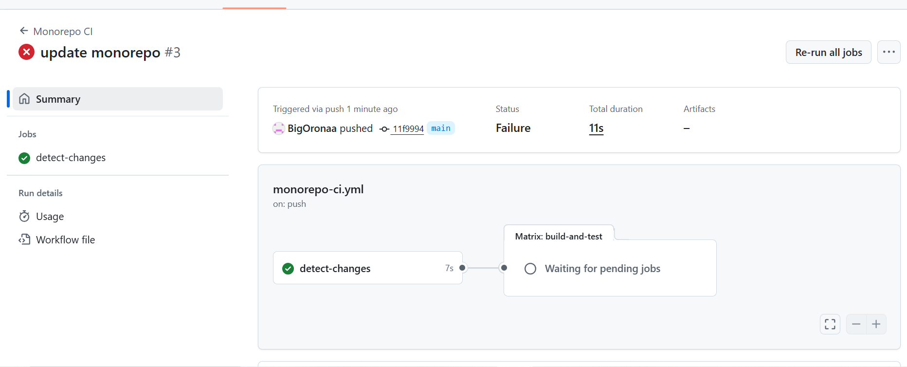
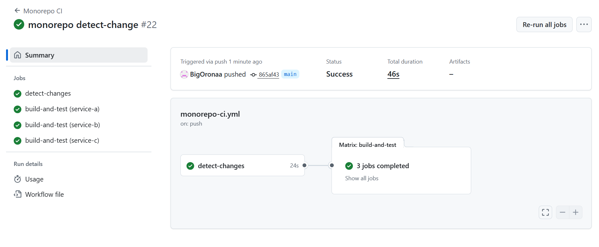
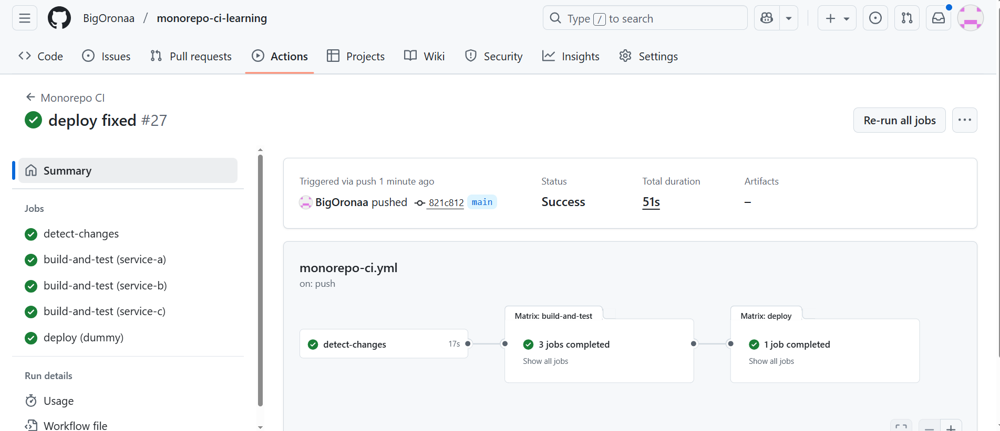
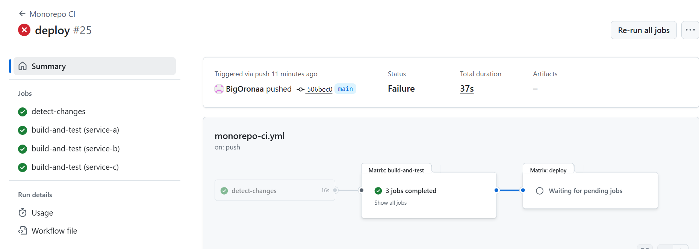
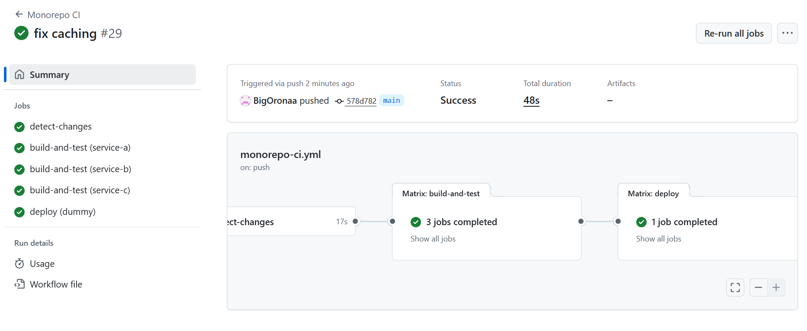
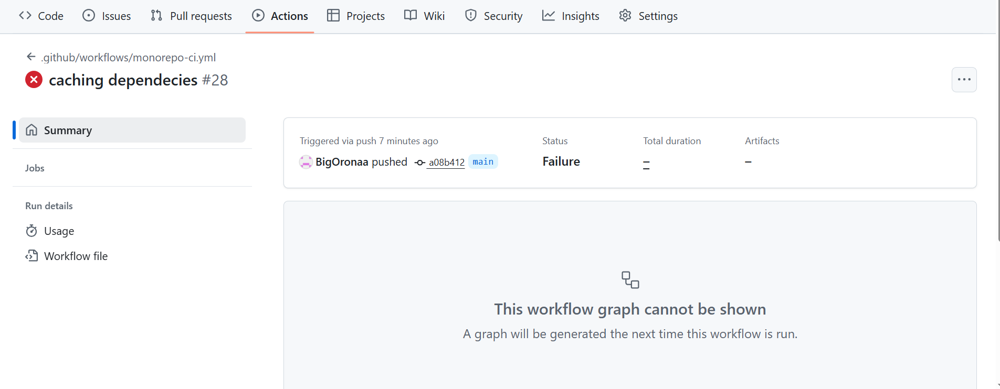
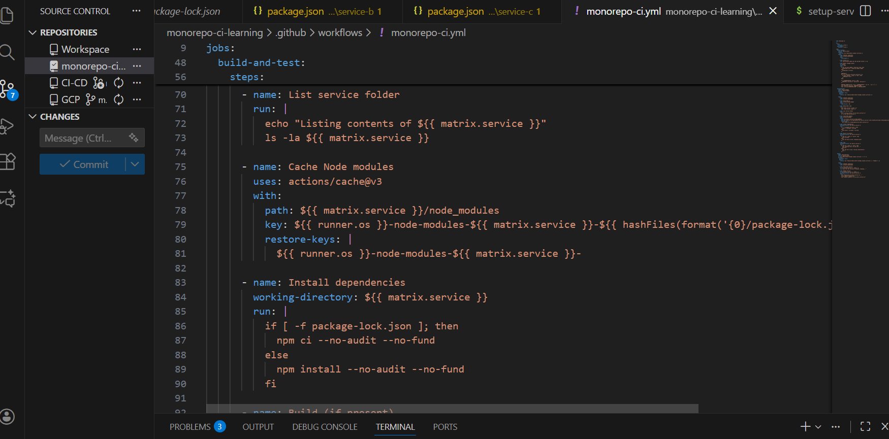

# Project: Building an Efficient CI/CD Pipeline for a Monorepo

## Project Overview
I built an efficient CI/CD pipeline for a monorepo structure. The monorepo contains multiple services, each in its own folder (`service-a`, `service-b`, `service-c`). My goal was to ensure that only services affected by code changes are built, tested, and deployed, reducing build times and optimizing resource usage.

**Monorepo Structure Example:**
```
monorepo/
├── service-a/
├── service-b/
├── service-c/
└── ...
```

**Goal:**
- Detect changes per service folder.
- Run build, test, and deploy stages only for modified services.
- Cache dependencies to optimize build time.
- Ensure workflow adheres to security best practices.

---

**Implentations**

### 1. Committed Service Folders to GitHub
I first created the service folders (`service-a`, `service-b`, `service-c`) locally, added sample files (`index.js`, `test.js`, `package.json` with Jest tests), and committed them to the GitHub repository. This was the starting point of the project.

### I added Screenshots


### 2. Detect Changes
I implemented a GitHub Actions job to detect which service folders have been modified in a commit. This job:

- Checks out the repository.
- Installs `jq` for JSON processing.
- Detects changed files using `git diff` or lists all files for the first commit.
- Compares changed files against the service folders.
- Defaults to all services if no changes are detected.
- Outputs a JSON array of changed services to be used in downstream jobs.

### I added Screenshots


**Error Encountered:** `Error: Unable to process file command 'output' successfully.` and `Error: Invalid format '  "service-a",'` was seen after the first commit.

### I added Screenshots


**Fix:** I rewrote the JSON formatting step to ensure JSON was clean, compact, and valid: `SERVICES_JSON=$(printf '%s\n' "${SERVICES[@]}" | jq -R . | jq -c -s .) echo "services=$SERVICES_JSON" >> $GITHUB_OUTPUT` 

### 3. Build and Test
I set up a matrix job to build and test each detected service:

- Checks out the repository and sets up Node.js.
- Lists the contents of the service folder for debugging.
- Installs dependencies using `npm ci` if a lock file exists, otherwise `npm install`.
- Runs `npm run build` if a build script is present.
- Runs tests using `npm test`.
- Only runs for services detected in the previous step.

### I added Screenshots


### 4. Deploy
I created a deploy job that:

- Runs only after successful build and test jobs.
- Uses a matrix for each detected service.
- Skips a dummy service if no changes were detected.
- Executes deploy commands for each real service.


### I added Screenshots


**Error Encountered:** On the First push i got `Error when evaluating 'strategy' for job 'deploy'. .github/workflows/monorepo-ci.yml (Line: 109, Col: 18): Error from function 'fromJson': empty input, .github/workflows/monorepo-ci.yml (Line: 109, Col: 18): Unexpected value ''` and the deploy failed.

### I added Screenshots


**Fix:** I Used a fallback "dummy" service to prevent failure when no services changed.


### 5. Caching Dependencies
I added caching to improve build performance:

- Cached `node_modules` per service using `actions/cache@v3`.
- Restored the cache before installing dependencies.
- This reduces repeated `npm install` time for unchanged dependencies.

### I added Screenshots


**Error Encountered:** The first push failed because of this `V(Line: 79, Col: 16): Unexpected symbol: '+'. Located at position 26 within expression: hashFiles(matrix.service + '/package-lock.json')`. 

### I added Screenshots


**Fix:** I edited my `YAML` file and corrected all syntax, removed unsafe expressions, and simplified matrix definitions.

### I added Screenshots



### 6. Conditional Execution
All pipeline stages (build, test, deploy) are executed conditionally based on whether a service has been modified. This ensures that unmodified services do not consume unnecessary CI/CD resources.

### 7. Security and Best Practices
I ensured the workflow adheres to security best practices:

- Uses checkout actions with minimal fetch depth.
- Avoids exposing secrets in logs.
- Follows safe caching practices.
- Only runs commands for detected changes.

## Outcome
- The CI/CD pipeline now efficiently builds, tests, and deploys only the services affected by code changes.
- Build times and resource consumption are reduced.
- Developer productivity is improved with faster feedback loops.

## Monorepo Structure
```
monorepo/
├── service-a/
│   ├── index.js
│   ├── test.js
│   └── package.json
├── service-b/
│   ├── index.js
│   ├── test.js
│   └── package.json
├── service-c/
│   ├── index.js
│   ├── test.js
│   └── package.json
└── .github/
    └── workflows/
        └── monorepo-ci.yml
```

---

**Conclusion**

I successfully implemented a dynamic, efficient CI/CD pipeline for a monorepo using GitHub Actions. The pipeline:
- Detects changes per service
- Runs build, test, and deploy only for affected services
- Uses caching to optimize builds
- Adheres to security best practices


---


**Monorepo Folder** I created a repo that hosted the Monorepo codes `YAML` 
### Link to the repo: `https://github.com/BigOronaa/monorepo-ci-learning`
